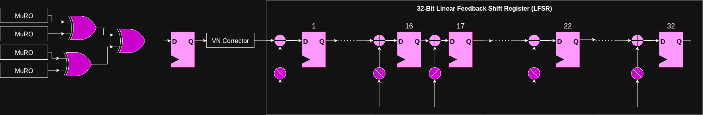
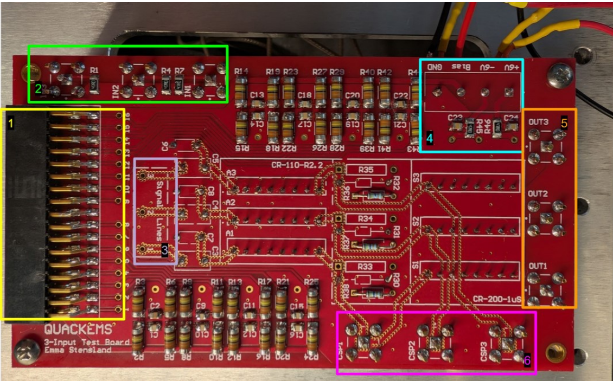
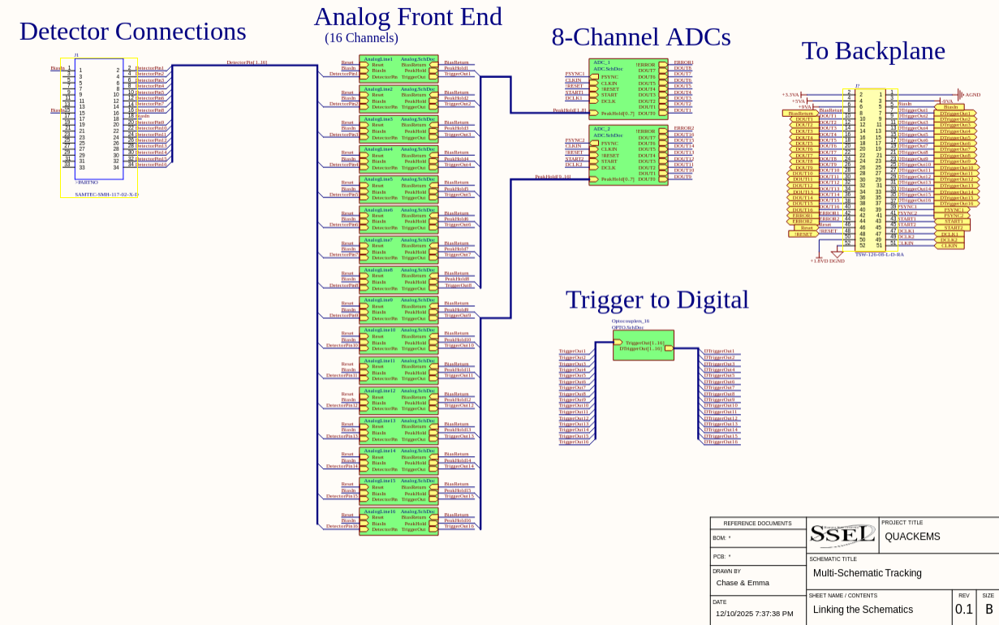

# Emma Stensland's Portfolio

Welcome! This portfolio highlights my favorite projects, with links to repositories and detailed reports.

---

## 📚 Table of Contents

- [🛡️ Security Projects](#-security-projects)  
- [⚡ Hardware Systems](#-hardware-systems)
- [💥 Other Projects & Media](#-other-projects--media)
- [📬 Contact](#-contact)

---

## 🛡️ Security Projects

### 🔀 [TRNG on FPGA](https://github.com/stenslae/FPGA_TRNG)

Custom True Random Number Generator implemented on an SoC FPGA.

- **Technologies:** VHDL, MURO ring oscillators, Von Neumann correction, LFSR whitening, Linux userspace & kernel drivers, NIST STS validation
- **Skills:** hardware entropy extraction, cryptographically secure design, statistical validation
- **Results:** Produced a fully validated TRNG IP core with provable statistical randomness
- **[Full Report](https://github.com/stenslae/FPGA_TRNG/blob/main/docs/trng.md)**

**System Diagram:**

### 🌌 [Pulsar Side-Channel Analysis](https://github.com/stenslae/PulsarSideChannel)

Simulated EM side-channel attacks on pulsar-like signals, including scrambling, leakage analysis, & seed recovery.

- **Technologies:** MATLAB/Octave, Fourier & Hilbert transforms, PRNG-based scrambling, signal processing
- **Skills:** side-channel analysis, spectral fingerprinting, envelope detection, brute-force seed recovery, SNR/noise handling
- **Results:** Demonstrated effective seed recovery under varied noise conditions and analyzed leakage metrics
- **[Full Report](https://github.com/stenslae/PulsarSideChannel/blob/main/pulsar_report.md)**
  
---

## 🔌 Hardware Systems

### ☢️ [3 Input Test Board](https://github.com/stenslae/3InputTestBoard)

Analog PCB for silicon strip detector readout and characterization.

- **Technologies:** Altium, LTSpice, Analog Circuit Design, Soldering
- **Skills:** analog filtering, shielding
- **Impact:** Successfully routed 3-channel analog front-end and made a usage guide for live radiation testing
- **[Full Report](https://github.com/stenslae/3InputTestBoard/blob/main/Docs/quackems_test_board_operation.pdf)**

**Board Image:**

### 🛠️ [Instrument Simulator for REAL Flatsat](https://github.com/stenslae/InstrumentSim)  
- Teensy 4.1 simulator for cubesat instrument telemetry.  
- **Technologies**: C/C++, Teensy, UART  
- **Key Features**: command packet processing (CCSDS), CRC-16, telemetry output, robust OBC testing
- **Results:** Enables hardware-in-the-loop testing

### ⚡ Detector Data Acquisition *(Coming Soon)*

Multi-board DAQ system for silicon strip detectors on a potential cubesat instrument.

- **Technologies:** FPGA, 8-channel 16-bit ADCs, custom differential ZCD & peak follower
- **Skills:** high-speed analog design, synchronized data acquisition
- **Results:** 200 kHz bandwidth, 20 mV–5 V dynamic range

**Top Level Analog Schematic:**

**Analog Signal Processing Schematic:**

---

## 💥 Other Projects & Media

### 🎥 [Firmware & Embedded Security Video](https://youtu.be/J5bsz8OYWcQ)

Video essay explaining firmware/embedded security topics.

- **Skills:** hardware root of trust, multi-stage boot verification, local & remote attestation, OTA security practices

---

## 📬 Contact

Feel free to reach out:  

- 📧 **Email**: [emma@stensland.com](mailto:emma@stensland.com)
