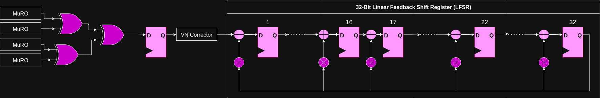
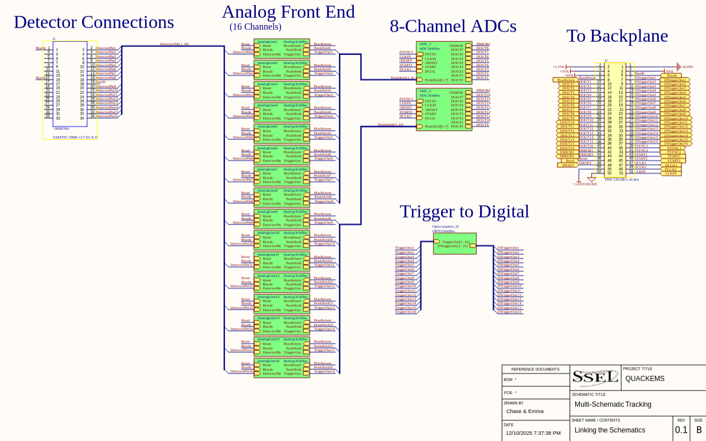
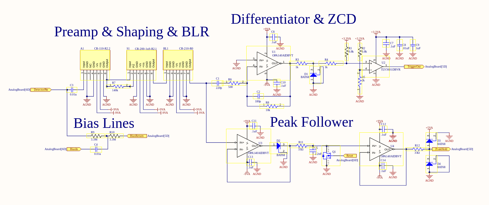

# Emma Stensland's Portfolio

## [TRNG on FPGA](https://github.com/stenslae/FPGA-TRNG)
- **Technologies:** VHDL, MURO ring oscillators, Von Neumann correction, LFSR whitening, Linux userspace & kernel drivers, NIST STS validation
- **Skills:** hardware entropy extraction, cryptographically secure design, statistical validation
- **[Full Report](https://github.com/stenslae/FPGA_TRNG/blob/main/docs/trng.md)**

## [Pulsar Side-Channel Analysis](https://github.com/stenslae/PulsarSideChannel)
- **Technologies:** MATLAB/Octave, Fourier & Hilbert transforms, PRNG-based scrambling, signal processing
- **Skills:** side-channel analysis, spectral fingerprinting, envelope detection, brute-force seed recovery, SNR/noise handling
- **[Full Report](https://github.com/stenslae/PulsarSideChannel/blob/main/pulsar_report.md)**

## SSD Data Acquisition System
- **Technologies:** FPGA, 8-channel 16-bit ADCs, PCB design, custom differential ZCD & peak follower
- **Skills:** high-speed analog design, data acquisition

---

## 📬 Contact

Feel free to reach out:  

- 📧 **Email**: [emma@stensland.com](mailto:emma@stensland.com)
